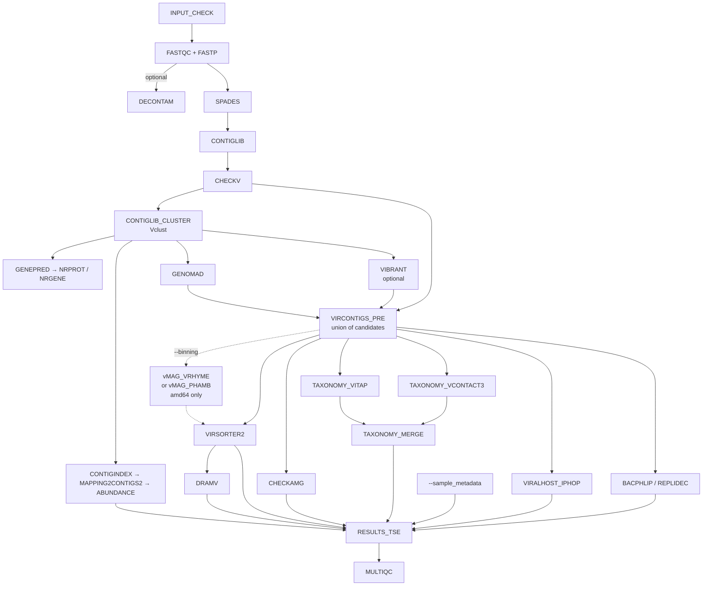

# Handoff — modernization of `dev_ru`

State of the 2026 revival of ViroProfiler, and what a new working session needs to know.
Companion documents: [KNOWN_ISSUES.md](dev/KNOWN_ISSUES.md) (every defect found, with status),
[ARM64.md](dev/ARM64.md) (what can and cannot be built for aarch64),
[PACKAGING.md](dev/PACKAGING.md) (how the images declare and freeze their dependencies).

## Where the pipeline stands

The pipeline runs end to end and produces a TreeSummarizedExperiment. The reference run is
the sixteen-sample test set (`assets/samplesheet_testfull.csv`, seven `HT` and nine `UC`),
on aarch64 with the pixi-built images and every optional module on except iPHoP, which has
no aarch64 build:

| | |
|---|---|
| Contigs | 161 in the dereplicated library, 100 called viral |
| Samples | 16, in two groups |
| Assays | `counts`, `tpm`, `trimmed_mean`, `covfrac` |
| `rowData` | 55 columns |
| `colData` | `sample_name`, `group`, `n_reads_total`, `n_reads_mapped`, `mapping_rate` |
| Lineages | 92 contigs, across 34 families |
| Gene annotations | 3511 in `metadata()`, 1954 from CheckAMG and 1557 from DRAM-v |
| Wall clock | about 40 minutes on one spark node, 16 cores |

Anything that changes those numbers is a result change and needs explaining. Reproduce with
the command under [Running it on this machine](#running-it-on-this-machine).

A two-sample subset (HT02, UC20) is kept as a fast check, and is what most of the
verification below was done on: 22 contigs, 18 of them viral. It is enough to exercise every
process and nothing that needs more than one sample per group — no ordination, no PERMANOVA,
no group comparison of any kind. Use the sixteen-sample set for anything statistical.

Everything is committed on `dev_ru` and **not pushed**, so that it can be squash-merged into
`main`.

## Pipeline shape



`--mode` decides how far down that graph a run goes. The stages are cumulative — `fastqc` →
`fastp` → `contiglib` → `all` — so a mode is a prefix of the pipeline, not a branch, and
reporting (`CUSTOM_DUMPSOFTWAREVERSIONS`, `MULTIQC`) runs in every one of them. `setup` is
separate: it builds databases and reads no samplesheet. The numbering lives in
`WorkflowViroprofiler.MODE_STAGE` ([lib/WorkflowViroprofiler.groovy](../lib/WorkflowViroprofiler.groovy)),
which is also what rejects an unknown mode and what rejects `fastqc`/`fastp` together with
`--reads_type clean` — that combination skips both stages and would otherwise run empty.

Two relationships in that graph are easy to misread and expensive to get wrong:

- **VirSorter2 is not a detector.** Detection is the union formed in `VIRCONTIGS_PRE` from
  geNomad, CheckV quality and optionally VIBRANT. VirSorter2 runs *downstream* of that union
  purely to emit `viral-affi-contigs-for-dramv.tab`. Remove it and `DRAM-v.py distill` raises
  `KeyError` on `auxiliary_score`, a column `add_dramv_scores_and_flags()` creates only when
  VirSorter2 output is present.
- **`CONTIGLIB_CLUSTER` dereplicates *all* contigs, not just viral ones.** Its output is the
  read-mapping reference for abundance, which is why viral identification happens after it
  rather than before. Moving geNomad ahead of it would quietly change what `RESULTS_TSE`
  reports abundance for.

## Running it on this machine

The published `denglab/*` images are amd64-only, so this aarch64 host uses locally built SIFs
through the `arm64_local` profile:

```bash
export NXF_SYNTAX_PARSER=v1

nextflow run main.nf \
  -profile apptainer,arm64_local -resume \
  --sif_dir ~/singularity/viroprofiler-pixi \
  --input samplesheet.csv \
  --sample_metadata metadata.csv \
  --db /mnt/scratch/db/viroprofiler \
  --container_binds /home/allen/data2/db,/mnt/nas26/db,/home/allen/bioinfo/models \
  --use_dram false \
  --max_cpus 8 --max_memory 32.GB
```

Four things about that command are not obvious:

- **`NXF_SYNTAX_PARSER=v1` is mandatory, not tuning.** Nextflow 25.x made a restricted config
  language the default, and this pipeline is not written in it: the run dies at startup with
  a parse error pointing at a config line rather than at the cause. It is easy to miss
  because an interactive shell may already export it — which is why this went unnoticed until
  a `sbatch --export=NIL` job stripped it. [I-45](dev/KNOWN_ISSUES.md#i-45) lists what has to
  move and why config and scripts have to migrate together.
- **`--container_binds` is required here, not optional.** Nextflow invokes Apptainer with
  `--no-home`, so nothing outside the work directory is visible unless it is bound. Several
  entries under `--db` are symlinks into `~/data2/db` and `/mnt/nas26/db`, and the geNomad
  database is a *two-hop* symlink whose second hop lands in `~/bioinfo/models` — that third
  path is why the first real geNomad run failed.
- **`--sample_metadata` is what makes the output analysable.** Without it `colData` holds one
  column, the sample name, and no group-wise comparison is possible on the object the
  pipeline exists to produce. It cannot ride in the samplesheet: `INPUT_CHECK` rejects
  anything that is not exactly three columns.
- **`--use_dram false` is a local convenience, not a recommendation.** The DRAM database is
  built and working; DRAM is simply the slowest step and is usually not what is being tested.

On a Slurm submission add `--sif_dir` pointing somewhere both nodes can see. `~/singularity`
is node-local: it *exists* on spark2 with a different, older set of images, so a job that
points there does not fail with "no such path" — it silently uses the wrong containers.

Databases live at `/mnt/scratch/db/viroprofiler`:

| Database | Size | Location |
|---|---|---|
| `dram` | 38 GB | local |
| `vibrant` | 11 GB | local |
| `vitap` | 1.3 GB | local |
| `checkv`, `virsorter2`, `genomad`, `eggnog` | — | symlinks into `~/data2/db` |
| `vcontact3`, `checkamg` | — | symlinks into `/mnt/nas26/db` |

The `taxonomy/` tree there — the MMseqs2 vRefSeq database and the 2022 NCBI taxdump, 3.4 GB —
has no consumer any more and can be deleted.

SIFs live in two directories on this host. `~/singularity/viroprofiler-pixi/` holds the
current, pixi-built set and is what `--sif_dir` above points at;
`~/singularity/viroprofiler/` holds the previous micromamba-built set, kept as a fallback
while the new images are still new. `viroprofiler-taxa.sif` in the older directory is a
leftover of the retired vConTACT2 image and can be deleted.

`bash docker/build_arm64.sh <name>` rebuilds one image; `SIF_DIR=<path>` chooses where the
SIFs go, and defaults to `~/singularity/viroprofiler`. Once the pixi images have been used
for a while, replace the older set and drop the `--sif_dir` override.

## Testing what you change

Four checks, cheapest first. The first three take seconds and need no database.

```bash
# 1. Topology. Every process runs as a no-op; proves the graph still wires up.
nextflow run main.nf -stub -profile test_stub

# 2. The mode ladder. Each mode must run its own stages and stop.
for m in fastqc fastp contiglib all; do nextflow run main.nf -stub -profile test_stub --mode $m; done

# 3. Lockfiles match their manifests. --dry-run is required: plain --check rewrites
#    pixi.lock while exiting non-zero, absorbing the drift it just reported.
for m in docker/*/pixi.toml; do pixi lock --check --dry-run --manifest-path "$m"; done

# 4. Real data, once the above are green. Numbers to match are in the first section.
#    --binning phamb cannot be reached here; see the arch guard.
nextflow run main.nf -profile apptainer,arm64_local ...    # full command above
```

[`.github/workflows/stub_test.yml`](../.github/workflows/stub_test.yml) runs 1 and 2 on every
push, plus the SE, contig-annotation, setup and optional-module variants, plus the PHAMB path
— the runner is x86-64, which makes CI the only place `--binning phamb` is exercised at all.
[`docker.yml`](../.github/workflows/docker.yml) runs 3.

Two things none of them can tell you, so check by hand:

- **Whether a changed output still has the columns its consumers read.** The stub passes
  either way; see the second rule below.
- **Whether a resource change took effect.** `nextflow.config` requesting 4 CPUs proves
  nothing; `grep -c 'vclust.* -t 4' work/*/*/.command.sh` does.

## Verification discipline

These are not style preferences. Each one corresponds to a defect that shipped in this
repository and stayed invisible for years.

- **An exit status proves nothing about a database.** VIBRANT's `download-db.sh` ends in an
  unconditional `exit 0` and prints a success message after its setup script has died. DRAM's
  dbCAN download stored an 8 KB HTML landing page as a database. VITAP publishes a `.dmnd`
  that `diamond dbinfo` reads happily and `diamond blastp` rejects. vConTACT3's
  `prepare_databases` reports a failure it did not have. Every `DB_*` process therefore builds
  into the task work directory, checks the *content* of what it produced, and publishes only
  then. Keep it that way.
- **Stub tests validate topology, not schemas.** They pass whether or not a process writes the
  columns its consumers read — the DVF stub advertised `contig_id/dvf_score` while the real
  output was `name/len/score/pvalue/qvalue`, and nothing noticed. When you change an output,
  diff the stub header against a real product. The taxonomy table `RESULTS_TSE` reads is where
  this bites hardest today: [`bin/merge_taxonomy.py`](../bin/merge_taxonomy.py) writes it,
  vpfkit's `read_taxonomy2()` demands an exact column set, and `create_vpftse_vir()` treats a
  non-missing `Domain` as one of the votes that make a contig viral — so a renamed column
  there shrinks the viral TSE instead of raising anything.
- **Loosening a version pin on a 2022-era tool is not an upgrade, it is an untested
  environment.** Unpinned solves reached Python 3.14, setuptools 84, snakemake 8, numpy 1.24,
  scipy 1.15 and pandas 3 — breaking DRAM, vConTACT2/3, VirSorter2, eggNOG-mapper and bacphlip
  in five different ways. See [PACKAGING.md](dev/PACKAGING.md): the real fix is lockfiles.
- **A subagent or Codex finding is a lead, not a fact.** Roughly half survive verification.
  The failure mode worth naming is the finding that is *correct about the excerpt it was
  shown*: an elided block in a review prompt produced a confident, mechanically sound report
  that `CUSTOM_DUMPSOFTWAREVERSIONS` never runs under `--mode contiglib --reads_type clean`,
  which four `ch_versions.mix` calls just outside the excerpt disprove. Verify against the
  file, not the excerpt — and when a finding does hold, follow it past the symptom: the
  report that VAMB's `--jgi` pairs depths positionally is what exposed that the pinned VAMB
  had no `--jgi` at all.
- **A clean solve is not a working environment.** Some conda packages ship only a post-link
  script that fetches what they nominally provide. micromamba runs those, pixi does not, and
  the difference shows up in neither the solve nor the lockfile — `bioconductor-genomeinfodbdata`
  consists of nothing else, and without it `GenomeInfoDb` installs and cannot be loaded. This is
  why every Dockerfile ends with a smoke test that exercises the tools under `env -i` with the
  image's own `PATH`.

## How the images are built

Every image except `viroprofiler-host` is built by pixi from a committed lockfile:
`docker/viroprofiler-*/pixi.toml` states the intent, `pixi.lock` records what was chosen, and
`pixi install --locked` fails the build if the two disagree, and each Dockerfile ends with the
`env -i` smoke test described above.

Re-lock deliberately and re-test; a lock refreshed as a side effect of a rebuild is exactly
the failure mode it exists to prevent. In CI gate on `pixi lock --check --dry-run`: plain
`--check` exits non-zero on drift but rewrites `pixi.lock` while doing so.

`viroprofiler-host` stays on micromamba because its conda specs live in the iPHoP fork's own
checkout, and it is amd64-only in any case. Reasoning and per-image notes:
[PACKAGING.md](dev/PACKAGING.md).

## Not done yet

Ordered by how much they change results.

1. **Push vpfkit and bump `VPFKIT_REF`.** `docker/viroprofiler-viewer/Dockerfile` installs
   vpfkit from GitHub at a pinned commit, and the commit it names predates the rewrite. Until
   both happen, a rebuilt viewer image carries the old package and `RESULTS_TSE` will fail on
   `annotate_viral_votes` not being exported — after every upstream process has finished. The
   sixteen-sample reference run above was produced with an image built from the local
   working tree (`denglab/viroprofiler-viewer:localtest`), which is a verification artefact,
   not something anyone else can reproduce.
2. **Migrate to the Nextflow v2 config and script language** — [I-45](dev/KNOWN_ISSUES.md#i-45).
   Every run today depends on `NXF_SYNTAX_PARSER=v1` being exported. This has to be one
   change covering config and scripts together, and it moves `manifest.nextflowVersion`.
3. **Push the images to Docker Hub.** `conf/modules.config` references tags that exist only as
   local SIFs — `vcontact3`, `vclust`, `vitap`, `genomad`, `checkamg` were never published,
   and every other image now differs in content from the tag it names — so every profile other
   than `arm64_local` is currently broken. This is the last step before anyone else can run
   the pipeline. Bump the tags rather than overwriting: an image built from a lockfile and one
   built from a loose environment file are not the same artifact, and reusing `v0.2`/`v0.3`
   would leave existing installations silently on the old one.
4. **Run on amd64.** Nothing here has been built or run on x86-64, and two paths have no
   aarch64 execution route at all, so that run is their first real test:
   - `--binning phamb`, end to end. Watch VAMB in particular: the depth table is built in
     FASTA order by name lookup because `--jgi` pairs depths to contigs positionally, and the
     process asserts the row count, so a mismatch fails loudly rather than clustering on
     shuffled abundances. Then check that `run_RF.py` resolves to `/usr/local/bin/run_RF.py`
     and that `vambbins_RF_predictions.txt` is non-empty.
   - `--use_iphop`, which is forced off in the arm64 profile.
5. **Restore the `.github/workflows/docker.yml` build matrix.** Every entry is still
   commented out, so no image is built by CI on either architecture. The lockfile gate that
   should accompany it (`check_locks`) is already in place; what is missing is the build and
   push itself, which is the same work as item 1.
6. **Decide whether the `virsorter2` environment inside `viroprofiler-base` stays.** No
   process reads it — everything that runs VirSorter2 carries the `viroprofiler_virsorter2`
   label and gets its own image — and it is worth about 1 GB. It was left in place so that the
   pixi migration changed packaging and nothing else.
7. Remaining `Open` rows in [KNOWN_ISSUES.md](dev/KNOWN_ISSUES.md), including the committed
   `output_stub*` directories and the literal `${HOME}` in `assets/samplesheet_contigs.csv`.

## Limits of what has been verified

- **Only one dataset.** Sixteen samples, 161 contigs, from one study. Cluster-level agreement
  between the old BLAST recipe and Vclust was measured on a purpose-built 1600-sequence set
  (99.88 % of clusters identical), but real behaviour at 10⁵ contigs is untested — which
  matters most for the `-max_target_seqs` truncation the switch was meant to fix, since that
  defect only manifests on libraries large enough to trigger it.
- **Nothing has been built or run on amd64.** Every image was built natively on aarch64.
- **`--binning phamb` has never been executed.** Its topology is exercised by the stub, the
  score-table converter is checked against phamb's own parser, and the image asserts the
  random forest deserialises — but VAMB has no aarch64 build, so the path itself has not run
  end to end anywhere. Treat the first amd64 run as its first test.
- **PHAMB's bin calls are approximate by construction.** Its forest was fitted on
  DeepVirFinder's score distribution and is given geNomad's. The two scores share a range and
  a meaning but not a calibration, and the size of the disagreement has not been measured.
  `--binning vrhyme` carries no such caveat.
- **iPHoP and DeepVirFinder cannot run on this host at all** — see
  [ARM64.md](dev/ARM64.md) for the evidence. `use_iphop` is false in the arm64 profile, so
  host prediction is unexercised here.
- **The iPHoP slot of `RESULTS_TSE` has never carried a real file.** iPHoP cannot run on
  aarch64, so every run here passed the placeholder. `read_iphop()` was checked against
  iPHoP's documented output and a fixture, not against a table this pipeline produced.
- **`DB_GENOMAD`, `DB_CHECKAMG` and the fresh-download path of `DB_VCONTACT3` have never been
  run**; existing local databases were reused. Their verification functions were tested
  against real databases in both directions, but the download and publish steps were not.
- **`DRAM-setup.py prepare_databases` with `--use_uniref` was never attempted** (hundreds of
  GB); the pipeline builds with `--skip_uniref`.
- **Two of the pixi-built images have been compared against their micromamba predecessors on
  real data**, and both matched: `viroprofiler-replicyc` (bacphlip byte-identical on four
  phage genomes; Replidec identical in every classification, differing only in row order and
  the last bit of one likelihood) and `viroprofiler-base` (CheckV's `quality_summary.tsv` and
  `checkv_qc_long.fasta`, and the contig-library clustering, all byte-identical on the
  two-sample dataset). The remaining images are verified by their build-time smoke tests and
  by having run in the end-to-end test, not by output comparison against the old images.
