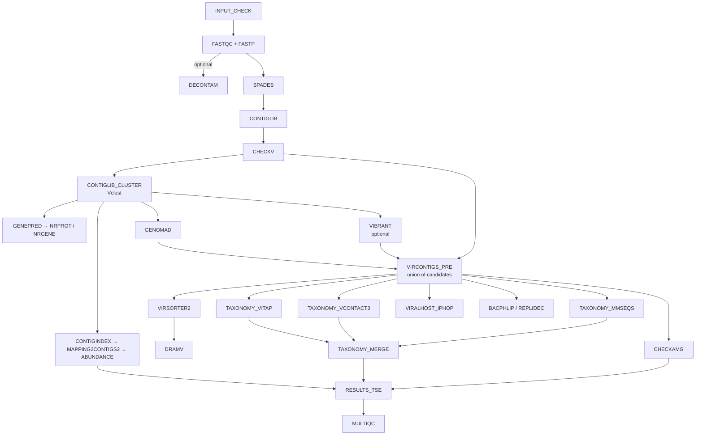

# Handoff — modernization of `dev_ru`

State of the 2026 revival of ViroProfiler, and what a new working session needs to know.
Companion documents: [KNOWN_ISSUES.md](dev/KNOWN_ISSUES.md) (every defect found, with status),
[ARM64.md](dev/ARM64.md) (what can and cannot be built for aarch64),
[PACKAGING.md](dev/PACKAGING.md) (whether to move the images to pixi).

## Where the pipeline stands

The pipeline runs end to end and produces a TreeSummarizedExperiment. On a two-sample test
(HT02, UC20) from a cold start with no resume cache: 29 processes, 0 failures, and a viral
TSE of 18 contigs × 2 samples with `counts`, `tpm`, `tmm` and `covfrac` assays and 37
`rowData` columns.

That is a low bar in absolute terms — two samples, 23 contigs — but it is the first complete
run this repository has produced: before this work, no `.rds` existed anywhere in the tree.

Everything below is committed on `dev_ru` and **not pushed**, so that it can be squash-merged
into `main`.

## Pipeline shape



Two relationships in that graph are easy to misread and expensive to get wrong:

- **VirSorter2 is not a detector.** Detection is the union formed in `VIRCONTIGS_PRE` from
  geNomad, CheckV quality and optionally VIBRANT. VirSorter2 runs *downstream* of that union
  purely to emit `viral-affi-contigs-for-dramv.tab`. Remove it and `DRAM-v.py distill` raises
  `KeyError` on `auxiliary_score`, a column `add_dramv_scores_and_flags()` creates only when
  VirSorter2 output is present.
- **`CONTIGLIB_CLUSTER` dereplicates *all* contigs, not just viral ones.** Its output is the
  read-mapping reference for abundance, which is why viral identification happens after it
  rather than before. Moving geNomad ahead of it would quietly change what `RESULTS_TSE`
  reports abundance for.

## Running it on this machine

The published `denglab/*` images are amd64-only, so this aarch64 host uses locally built SIFs
through the `arm64_local` profile:

```bash
nextflow run main.nf \
  -profile apptainer,arm64_local -resume \
  --input samplesheet.csv \
  --db /mnt/scratch/db/viroprofiler \
  --container_binds /home/allen/data2/db,/mnt/nas26/db,/home/allen/bioinfo/models \
  --use_dram false \
  --max_cpus 8 --max_memory 32.GB
```

Two things about that command are not obvious:

- **`--container_binds` is required here, not optional.** Nextflow invokes Apptainer with
  `--no-home`, so nothing outside the work directory is visible unless it is bound. Several
  entries under `--db` are symlinks into `~/data2/db` and `/mnt/nas26/db`, and the geNomad
  database is a *two-hop* symlink whose second hop lands in `~/bioinfo/models` — that third
  path is why the first real geNomad run failed.
- **`--use_dram false` is a local convenience, not a recommendation.** The DRAM database is
  built and working; DRAM is simply the slowest step and is usually not what is being tested.

Databases live at `/mnt/scratch/db/viroprofiler`:

| Database | Size | Location |
|---|---|---|
| `dram` | 38 GB | local |
| `vibrant` | 11 GB | local |
| `taxonomy` (mmseqs vRefSeq + taxdump) | 3.4 GB | local |
| `vitap` | 1.3 GB | local |
| `checkv`, `virsorter2`, `genomad`, `eggnog` | — | symlinks into `~/data2/db` |
| `vcontact3`, `checkamg` | — | symlinks into `/mnt/nas26/db` |

SIFs are in `~/singularity/viroprofiler/`, rebuilt with `bash docker/build_arm64.sh <name>`.
`viroprofiler-taxa.sif` there is a leftover of the retired vConTACT2 image and can be deleted.

## Verification discipline

These are not style preferences. Each one corresponds to a defect that shipped in this
repository and stayed invisible for years.

- **An exit status proves nothing about a database.** VIBRANT's `download-db.sh` ends in an
  unconditional `exit 0` and prints a success message after its setup script has died. DRAM's
  dbCAN download stored an 8 KB HTML landing page as a database. VITAP publishes a `.dmnd`
  that `diamond dbinfo` reads happily and `diamond blastp` rejects. vConTACT3's
  `prepare_databases` reports a failure it did not have. Every `DB_*` process therefore builds
  into the task work directory, checks the *content* of what it produced, and publishes only
  then. Keep it that way.
- **Stub tests validate topology, not schemas.** They pass whether or not a process writes the
  columns its consumers read — the DVF stub advertised `contig_id/dvf_score` while the real
  output was `name/len/score/pvalue/qvalue`, and nothing noticed. When you change an output,
  diff the stub header against a real product.
- **Loosening a version pin on a 2022-era tool is not an upgrade, it is an untested
  environment.** Unpinned solves reached Python 3.14, setuptools 84, snakemake 8, numpy 1.24,
  scipy 1.15 and pandas 3 — breaking DRAM, vConTACT2/3, VirSorter2, eggNOG-mapper and bacphlip
  in five different ways. See [PACKAGING.md](dev/PACKAGING.md): the real fix is lockfiles.
- **A subagent or Codex finding is a lead, not a fact.** Of fifteen Codex findings across this
  work, seven survived verification. Check each against the code before acting.

## Not done yet

Ordered by how much they change results.

1. **Migrate the images to pixi.** Recommendation and evidence in
   [PACKAGING.md](dev/PACKAGING.md); start with `viroprofiler-replicyc` as a pilot. The
   ad-hoc pins now scattered through `docker/*/env_*.yml` (`python=3.10`, `setuptools<81`,
   `numpy<1.24`, `scipy<1.11`, `pandas<2`) are guesses that will rot again. Note the CI trap:
   `pixi lock --check` rewrites `pixi.lock` despite exiting 1, so gate on
   `--check --dry-run`.
2. **Push the five new images to Docker Hub**: `vcontact3`, `vclust`, `vitap`, `genomad`,
   `checkamg`. `conf/modules.config` already references tags that exist only as local arm64
   SIFs, so every profile other than `arm64_local` is currently broken.
3. **Decide whether mmseqs LCA taxonomy stays.** It is priority 4 behind VITAP, geNomad and
   vConTACT3, and it is the only remaining consumer of the NCBI taxdump pinned to the
   2022-08-01 archive ([I-08](dev/KNOWN_ISSUES.md)).
4. **Implement or drop `--mode fastqc` / `fastp` / `contiglib`.** All three are advertised in
   the parameter schema and the docs; only `setup` and `all` branch on anything
   ([I-11](dev/KNOWN_ISSUES.md)).
5. **Give `CONTIGLIB_CLUSTER` a resource label.** It still requests one CPU by default;
   Vclust's `-t $task.cpus` is wired and idle.
6. **Restore PHAMB binning or remove it.** `--binning phamb` now errors: PHAMB's random forest
   reads DeepVirFinder's score table, which no longer exists.
7. Remaining `Open` rows in [KNOWN_ISSUES.md](dev/KNOWN_ISSUES.md), including the committed
   `output_stub*` directories and the literal `${HOME}` in `assets/samplesheet_contigs.csv`.

## Limits of what has been verified

- **Only one dataset, and a small one.** Two samples, 23 contigs. Cluster-level agreement
  between the old BLAST recipe and Vclust was measured on a purpose-built 1600-sequence set
  (99.88 % of clusters identical), but real behaviour at 10⁵ contigs is untested — which
  matters most for the `-max_target_seqs` truncation the switch was meant to fix, since that
  defect only manifests on libraries large enough to trigger it.
- **Nothing has been built or run on amd64.** Every image was built natively on aarch64.
- **iPHoP and DeepVirFinder cannot run on this host at all** — see
  [ARM64.md](dev/ARM64.md) for the evidence. `use_iphop` is false in the arm64 profile, so
  host prediction is unexercised here.
- **`DB_GENOMAD`, `DB_CHECKAMG` and the fresh-download path of `DB_VCONTACT3` have never been
  run**; existing local databases were reused. Their verification functions were tested
  against real databases in both directions, but the download and publish steps were not.
- **`DRAM-setup.py prepare_databases` with `--use_uniref` was never attempted** (hundreds of
  GB); the pipeline builds with `--skip_uniref`.
