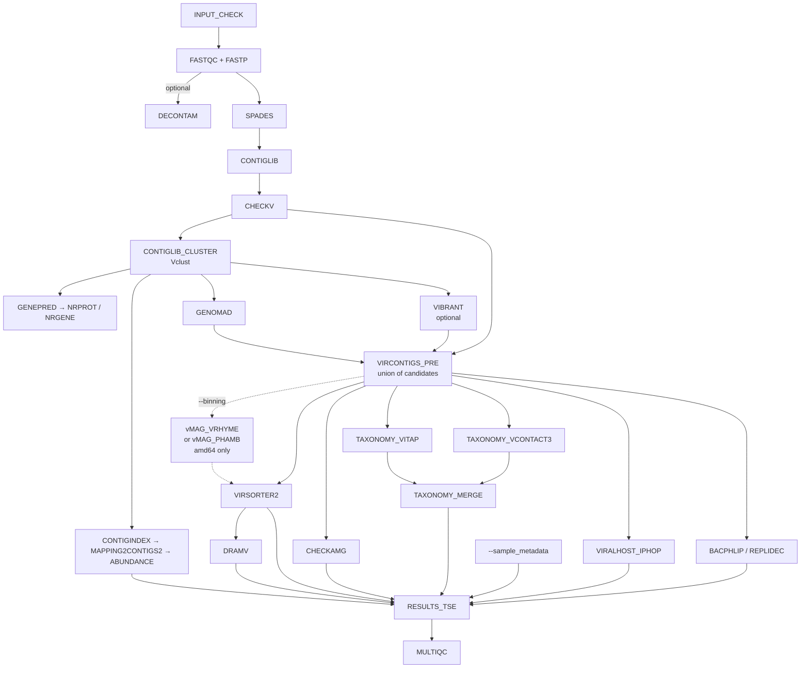
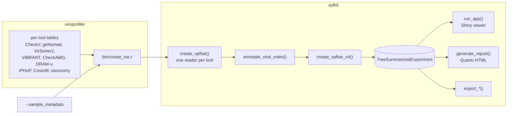

# Handoff — modernization of `dev_ru`

State of the 2026 revival of ViroProfiler, and what a new working session needs to know.
Companion documents: [KNOWN_ISSUES.md](dev/KNOWN_ISSUES.md) (every defect found, with status),
[ARM64.md](dev/ARM64.md) (what can and cannot be built for aarch64),
[PACKAGING.md](dev/PACKAGING.md) (how the images declare and freeze their dependencies).

## Start here

The pipeline is at 1.0.1 and works. It parses under the default parser of Nextflow 26.04, the
sixteen-sample reference run reproduces to `max |diff| = 0`, and every database path has been
built at least once. Nothing is pushed: `dev_ru` and vpfkit's `dev` are both local.

**One push blocks everyone else.** vpfkit `dev` is a single commit on top of
`deng-lab/vpfkit`'s `main`, ready to fast-forward, and
`docker/viroprofiler-viewer/Dockerfile` pins it by SHA. Until it lands, GitHub has never seen
that commit, so the viewer image cannot be built — by anyone, including CI — and item 2 under
[Not done yet](#not-done-yet) cannot start either. Items 3 onwards are independent of it.

Before changing anything, run the four fast checks under
[Testing what you change](#testing-what-you-change): they take seconds, need no database, and
are what caught most of what is recorded here.

## Where the pipeline stands

The pipeline runs end to end and produces a TreeSummarizedExperiment. The reference run is
the sixteen-sample test set (`assets/samplesheet_testfull.csv`, seven `HT` and nine `UC`),
on aarch64 with the pixi-built images and every optional module on except iPHoP, which has
no aarch64 build:

| | |
|---|---|
| Contigs | 161 in the dereplicated library, 100 called viral |
| Samples | 16, in two groups |
| Assays | `counts`, `tpm`, `trimmed_mean`, `covfrac` |
| `rowData` | 55 columns |
| `colData` | `sample_name`, `group`, `n_reads_total`, `n_reads_mapped`, `mapping_rate` |
| Lineages | 92 contigs, across 34 families |
| Gene annotations | 3511 in `metadata()`, 1954 from CheckAMG and 1557 from DRAM-v |
| Wall clock | about 40 minutes on one spark node, 16 cores |

Anything that changes those numbers is a result change and needs explaining. Reproduce with
the command under [Running it on this machine](#running-it-on-this-machine).

The strict-syntax migration was checked against this run rather than assumed harmless: the
same sixteen samples, from a `sbatch --export=NIL` job with `NXF_SYNTAX_PARSER` unset — the
submission that originally exposed the dependency on the legacy parser. Every per-tool
product came back byte-identical (`contigs_nrclib.fasta`, `taxonomy_tse.tsv`, CheckV's
`quality_summary.tsv`), and in the TreeSummarizedExperiment all four assays match to
`max |diff| = 0`, with `rowData` and `colData` identical.

**Two runs' `.rds` files are not byte-identical even so, and that is expected.** The sample
columns come back in whatever order the abundance tasks finished, so `colData` row order and
assay column order vary between runs. Contig order does not. Compare two objects by aligning
on `sample_name` first; an md5 of the `.rds` will always differ.

A two-sample subset (HT02, UC20) is kept as a fast check, and is what most of the
verification below was done on: 22 contigs, 18 of them viral. It is enough to exercise every
process and nothing that needs more than one sample per group — no ordination, no PERMANOVA,
no group comparison of any kind. Use the sixteen-sample set for anything statistical.

This is 1.0.1, the first release since the published version;
[vpfkit](#the-r-side-vpfkit-and-the-viewer) 0.6.0 is its R side, with `R CMD check` clean and
1107 tests passing. `dev_ru` is left unsquashed so that it can be squash-merged into `main`;
vpfkit's `dev` is already one commit. Neither is pushed — see [Start here](#start-here).

## Pipeline shape



`--mode` decides how far down that graph a run goes. The stages are cumulative — `fastqc` →
`fastp` → `contiglib` → `all` — so a mode is a prefix of the pipeline, not a branch, and
reporting (`CUSTOM_DUMPSOFTWAREVERSIONS`, `MULTIQC`) runs in every one of them. `setup` is
separate: it builds databases and reads no samplesheet. The numbering lives in
`WorkflowViroprofiler.MODE_STAGE` ([lib/WorkflowViroprofiler.groovy](../lib/WorkflowViroprofiler.groovy)),
which is also what rejects an unknown mode and what rejects `fastqc`/`fastp` together with
`--reads_type clean` — that combination skips both stages and would otherwise run empty.

Two relationships in that graph are easy to misread and expensive to get wrong:

- **VirSorter2 is not a detector.** Detection is the union formed in `VIRCONTIGS_PRE` from
  geNomad, CheckV quality and optionally VIBRANT. VirSorter2 runs *downstream* of that union
  purely to emit `viral-affi-contigs-for-dramv.tab`. Remove it and `DRAM-v.py distill` raises
  `KeyError` on `auxiliary_score`, a column `add_dramv_scores_and_flags()` creates only when
  VirSorter2 output is present.
- **`CONTIGLIB_CLUSTER` dereplicates *all* contigs, not just viral ones.** Its output is the
  read-mapping reference for abundance, which is why viral identification happens after it
  rather than before. Moving geNomad ahead of it would quietly change what `RESULTS_TSE`
  reports abundance for.

## Running it on this machine

The published `denglab/*` images are amd64-only, so this aarch64 host uses locally built SIFs
through the `arm64_local` profile:

```bash
nextflow run main.nf \
  -profile apptainer,arm64_local -resume \
  --sif_dir ~/singularity/viroprofiler-pixi \
  --input samplesheet.csv \
  --sample_metadata metadata.csv \
  --db /mnt/scratch/db/viroprofiler \
  --container_binds /home/allen/data2/db,/mnt/nas26/db,/home/allen/bioinfo/models \
  --use_dram false \
  --max_cpus 8 --max_memory 32.GB
```

Four things about that command are not obvious:

- **Nextflow 26.04 or newer, and `NXF_SYNTAX_PARSER` unset.** The pipeline is written in the
  strict language that release makes the default; `manifest.nextflowVersion` enforces it.
  Setting the variable to `v1` now breaks the run rather than fixing it, because the legacy
  parser rejects `env()` in the params block. [I-45](dev/KNOWN_ISSUES.md#i-45) records what
  moved.
- **`--container_binds` is required here, not optional.** Nextflow invokes Apptainer with
  `--no-home`, so nothing outside the work directory is visible unless it is bound. Several
  entries under `--db` are symlinks into `~/data2/db` and `/mnt/nas26/db`, and the geNomad
  database is a *two-hop* symlink whose second hop lands in `~/bioinfo/models` — that third
  path is why the first real geNomad run failed.
- **`--sample_metadata` is what makes the output analysable.** Without it `colData` holds one
  column, the sample name, and no group-wise comparison is possible on the object the
  pipeline exists to produce. It cannot ride in the samplesheet: `INPUT_CHECK` rejects
  anything that is not exactly three columns.
- **`--use_dram false` is a local convenience, not a recommendation.** The DRAM database is
  built and working; DRAM is simply the slowest step and is usually not what is being tested.

On a Slurm submission add `--sif_dir` pointing somewhere both nodes can see. `~/singularity`
is node-local: it *exists* on spark2 with a different, older set of images, so a job that
points there does not fail with "no such path" — it silently uses the wrong containers.

Databases live at `/mnt/scratch/db/viroprofiler`:

| Database | Size | Location |
|---|---|---|
| `dram` | 38 GB | local |
| `vibrant` | 11 GB | local |
| `vitap` | 1.3 GB | local |
| `checkv`, `virsorter2`, `genomad`, `eggnog` | — | symlinks into `~/data2/db` |
| `vcontact3`, `checkamg` | — | symlinks into `/mnt/nas26/db` |

The `taxonomy/` tree there — the MMseqs2 vRefSeq database and the 2022 NCBI taxdump, 3.4 GB —
has no consumer any more and can be deleted.

SIFs live in five directories, and which one you want depends on where the job runs:

| Directory | What it holds |
|---|---|
| `~/singularity/viroprofiler-pixi/` | The current pixi-built set. **spark1 only** — `~/singularity` is node-local |
| `~/singularity/viroprofiler/` | The previous micromamba set, kept as a fallback. `viroprofiler-taxa.sif` there is a leftover of the retired vConTACT2 image and can be deleted |
| `/mnt/nas26/singularity/viroprofiler-pixi/` | The same current set on shared storage. **This is what a Slurm job must point `--sif_dir` at** |
| `/mnt/nas26/singularity/viroprofiler-localtest/` | Only `viroprofiler-viewer.sif`, built from the local vpfkit tree. The reference runs overlay it on the set above |
| `/mnt/nas26/singularity/viroprofiler-curltest/` | Only `viroprofiler-vcontact3.sif`, rebuilt with `curl` ([I-52](dev/KNOWN_ISSUES.md#i-52)) |

The last one is the one to remember: **the vConTACT3 image in every other directory still
lacks `curl`**, so `--mode setup` cannot build that database with it. The manifest and lock
are fixed in the repository; folding the rebuilt image into the main set, or publishing it,
is part of item 2 under [Not done yet](#not-done-yet).

`bash docker/build_arm64.sh <name>` rebuilds one image; `SIF_DIR=<path>` chooses where the
SIFs go, and defaults to `~/singularity/viroprofiler`. Once the pixi images have been used
for a while, replace the older set and drop the `--sif_dir` override.

## The R side: vpfkit and the viewer

The pipeline's last process, `RESULTS_TSE`, is an R script that calls
[vpfkit](https://github.com/deng-lab/vpfkit), a separate repository checked out at
`~/github/rujinlong/vpfkit` (branch `dev`). Everything downstream of the tool outputs lives
there: the readers, the object constructor, the Shiny viewer, the Quarto report and the
exporters. Changing either repository without the other is the main way to break this.



*The pipeline produces tables; every interpretation of them is vpfkit's. `RESULTS_TSE` is the
only place the two meet, and `bin/create_tse.r` is the whole of the interface.*

Three parts of that interface are worth knowing before changing either side:

- **A reader is a schema contract.** Each `read_*()` names the columns its tool writes. Rename
  a column upstream and the reader returns nothing for it, silently, because a join that
  matches no rows is not an error. `metadata(tse)$viroprofiler$join_match` records what
  fraction of each tool's rows found a contig; a number far below what the tool should have
  produced is the symptom.
- **Optional inputs must stay optional.** `RESULTS_TSE` passes a `create_tse.r` argument only
  when the tool ran, and drops it otherwise, so `rowData` gains the tool's columns or none at
  all. That is what keeps "switched off" distinguishable from "found nothing". The empty
  placeholders live in [`assets/optional/`](../assets/optional/); adding an optional input
  means adding one there.
- **Assay names carry units.** `counts`, `tpm`, `trimmed_mean` and `covfrac` come from four
  separate CoverM invocations and are four different quantities. `trimmed_mean` is a coverage
  depth in x-fold, not a normalization; `covfrac` is a breadth in `[0, 1]` and is a detection
  mask, never an abundance. `metadata(tse)$viroprofiler$assays` carries that description with
  the object, and `normalize_assay_names()` maps older spellings onto the current ones.

### Opening the viewer

```bash
cd ~/github/rujinlong/vpfkit
bash dev/run_app.sh --lan --detach      # every interface, port 7474, keeps running
bash dev/run_app.sh --status
bash dev/run_app.sh --stop
```

On this host that is `http://192.168.2.5:7474`. `--lan` also exposes the "Path on this
server" input, which loads any `.rds` the account can read; `--no-server-path` turns that off
and leaves upload working.

The reference objects to open are

| Object | What it is good for |
|---|---|
| [`/mnt/nas26/testdata/viroprofiler_16sample/run_final/results/viroprofiler_output.rds`](file:///mnt/nas26/testdata/viroprofiler_16sample/run_final/results/) | Everything. 16 samples, two groups, DRAM-v and CheckAMG annotations. |
| `.../viroprofiler_output_all_contigs.rds` | The same run before the viral subset, for checking what the vote dropped. |
| `/home/allen/data2/testdata/viroprofiler_real_full/results/viroprofiler_output.rds` | The two-sample object, for the degraded paths: no groups, no gene annotations, legacy `tmm` assay name. |
| `.../viroprofiler_16sample/run_nf2/` and `run_nf2_head/` | The two strict-syntax regression runs, kept as the evidence behind the claim above. `run_nf2` is the migration commit, `run_nf2_head` is `dev_ru` tip. Both match `run_final` exactly once sample order is aligned. |

## Testing what you change

Five checks, cheapest first. The first four take seconds and need no database.

```bash
# 0. Syntax. The authority on what the strict parser accepts, and it reads lib/ too.
nextflow lint -o concise -project-dir . .

# 1. Topology. Every process runs as a no-op; proves the graph still wires up.
nextflow run main.nf -stub -profile test_stub

# 2. The mode ladder. Each mode must run its own stages and stop.
for m in fastqc fastp contiglib all; do nextflow run main.nf -stub -profile test_stub --mode $m; done

# 3. Lockfiles match their manifests. --dry-run is required: plain --check rewrites
#    pixi.lock while exiting non-zero, absorbing the drift it just reported.
for m in docker/*/pixi.toml; do pixi lock --check --dry-run --manifest-path "$m"; done

# 3b. The docs site. --strict turns a broken cross-reference into a failure.
#     pixi global install mkdocs --with mkdocs-material --with mkdocs-git-revision-date-plugin
mkdocs build --strict

# 4. Real data, once the above are green. Numbers to match are in the first section.
#    --binning phamb cannot be reached here; see the arch guard.
nextflow run main.nf -profile apptainer,arm64_local ...    # full command above
```

[`.github/workflows/stub_test.yml`](../.github/workflows/stub_test.yml) runs 1 and 2 on every
push, plus the SE, contig-annotation, setup and optional-module variants, plus the PHAMB path
— the runner is x86-64, which makes CI the only place `--binning phamb` is exercised at all.
[`docker.yml`](../.github/workflows/docker.yml) runs 3.

A change that touches what `RESULTS_TSE` writes needs vpfkit's checks too:

```bash
cd ~/github/rujinlong/vpfkit
Rscript -e 'devtools::test()'          # 1107 assertions, no network, seconds
Rscript -e 'devtools::check()'         # currently 0 errors, 0 warnings, 0 notes

# The viewer, in a real browser. Needs shinytest2 and a chromium.
NOT_CRAN=true CHROMOTE_CHROME=/snap/bin/chromium Rscript dev/verify_app_headless.R
```

`dev/verify_app_headless.R` defaults to the sixteen-sample object; point
`VPFKIT_TEST_TSE` at another one to check it. It exists because a browser walk over this app
passes without testing anything in two different ways — the dataset has to be *loaded*, not
merely chosen, and Shiny suspends outputs on inactive tabs — and its header says so.

Four things none of these can tell you, so check by hand:

- **Whether a changed output still has the columns its consumers read.** The stub passes
  either way; see the second rule below.
- **What a name inside a closure resolves to at run time.** `nextflow lint` type-checks
  declarations, not closure bodies: it passed a completion handler in which `params` was
  null, and it passes a `params { }` declaration whose types have drifted from
  `nextflow_schema.json`. Both fail at run time, one of them silently — see
  [I-50](dev/KNOWN_ISSUES.md#i-50).
- **Whether a resource change took effect.** `nextflow.config` requesting 4 CPUs proves
  nothing; `grep -c 'vclust.* -t 4' work/*/*/.command.sh` does.
- **Whether the viewer image contains the vpfkit you just changed.** It installs from GitHub
  at a pinned commit, so a local edit reaches `RESULTS_TSE` only after a push and a
  `VPFKIT_REF` bump. Until then, build the image from the working tree — that is what
  `denglab/viroprofiler-viewer:localtest` is, and why it is not a release artifact.

## Verification discipline

These are not style preferences. Each one corresponds to a defect that shipped in this
repository and stayed invisible for years.

- **An exit status proves nothing about a database.** VIBRANT's `download-db.sh` ends in an
  unconditional `exit 0` and prints a success message after its setup script has died. DRAM's
  dbCAN download stored an 8 KB HTML landing page as a database. VITAP publishes a `.dmnd`
  that `diamond dbinfo` reads happily and `diamond blastp` rejects. vConTACT3's
  `prepare_databases` reports a failure it did not have. Every `DB_*` process therefore builds
  into the task work directory, checks the *content* of what it produced, and publishes only
  then. Keep it that way.
- **Stub tests validate topology, not schemas.** They pass whether or not a process writes the
  columns its consumers read — the DVF stub advertised `contig_id/dvf_score` while the real
  output was `name/len/score/pvalue/qvalue`, and nothing noticed. When you change an output,
  diff the stub header against a real product. The taxonomy table `RESULTS_TSE` reads is where
  this bites hardest today: [`bin/merge_taxonomy.py`](../bin/merge_taxonomy.py) writes it,
  vpfkit's `read_taxonomy2()` demands an exact column set, and `create_vpftse_vir()` treats a
  non-missing `Domain` as one of the votes that make a contig viral — so a renamed column
  there shrinks the viral TSE instead of raising anything.
- **Loosening a version pin on a 2022-era tool is not an upgrade, it is an untested
  environment.** Unpinned solves reached Python 3.14, setuptools 84, snakemake 8, numpy 1.24,
  scipy 1.15 and pandas 3 — breaking DRAM, vConTACT2/3, VirSorter2, eggNOG-mapper and bacphlip
  in five different ways. See [PACKAGING.md](dev/PACKAGING.md): the real fix is lockfiles.
- **A subagent or Codex finding is a lead, not a fact.** Roughly half survive verification.
  The failure mode worth naming is the finding that is *correct about the excerpt it was
  shown*: an elided block in a review prompt produced a confident, mechanically sound report
  that `CUSTOM_DUMPSOFTWAREVERSIONS` never runs under `--mode contiglib --reads_type clean`,
  which four `ch_versions.mix` calls just outside the excerpt disprove. Verify against the
  file, not the excerpt — and when a finding does hold, follow it past the symptom: the
  report that VAMB's `--jgi` pairs depths positionally is what exposed that the pinned VAMB
  had no `--jgi` at all.
- **A clean solve is not a working environment.** Some conda packages ship only a post-link
  script that fetches what they nominally provide. micromamba runs those, pixi does not, and
  the difference shows up in neither the solve nor the lockfile — `bioconductor-genomeinfodbdata`
  consists of nothing else, and without it `GenomeInfoDb` installs and cannot be loaded. This is
  why every Dockerfile ends with a smoke test that exercises the tools under `env -i` with the
  image's own `PATH`.

## How the images are built

Every image except `viroprofiler-host` is built by pixi from a committed lockfile:
`docker/viroprofiler-*/pixi.toml` states the intent, `pixi.lock` records what was chosen, and
`pixi install --locked` fails the build if the two disagree, and each Dockerfile ends with the
`env -i` smoke test described above.

Re-lock deliberately and re-test; a lock refreshed as a side effect of a rebuild is exactly
the failure mode it exists to prevent. In CI gate on `pixi lock --check --dry-run`: plain
`--check` exits non-zero on drift but rewrites `pixi.lock` while doing so.

`viroprofiler-host` stays on micromamba because its conda specs live in the iPHoP fork's own
checkout, and it is amd64-only in any case. Reasoning and per-image notes:
[PACKAGING.md](dev/PACKAGING.md).

## Not done yet

Ordered by how much they change results.

1. **Push vpfkit.** The one manual step everything else waits on.
   `~/github/rujinlong/vpfkit` branch `dev` is a single commit,
   `efa71660aa548c53ca0277bdc69d91e02dc8f982`, on top of `deng-lab/vpfkit`'s `main` — a
   fast-forward, nothing to resolve. `docker/viroprofiler-viewer/Dockerfile` pins that SHA,
   so re-squashing or amending means updating `VPFKIT_REF` in the same change.

   `VPFKIT_REPO` is a build argument defaulting to `deng-lab/vpfkit`. While the commit lives
   only on a fork, build with
   `VPFKIT_REPO=rujinlong/vpfkit bash docker/build_arm64.sh viewer`.

   The sixteen-sample reference runs used an image built from the local working tree
   (`denglab/viroprofiler-viewer:localtest`), which is a verification artefact, not something
   anyone else can reproduce.
2. **Push the images to Docker Hub.** `conf/modules.config` references tags that exist only as
   local SIFs — `vcontact3`, `vclust`, `vitap`, `genomad`, `checkamg` were never published,
   and every other image now differs in content from the tag it names — so every profile other
   than `arm64_local` is currently broken. This is the last step before anyone else can run
   the pipeline. Bump the tags rather than overwriting: an image built from a lockfile and one
   built from a loose environment file are not the same artifact, and reusing `v0.2`/`v0.3`
   would leave existing installations silently on the old one.
3. **Run on amd64.** Nothing here has been built or run on x86-64, and two paths have no
   aarch64 execution route at all, so that run is their first real test:
   - `--binning phamb`, end to end. Watch VAMB in particular: the depth table is built in
     FASTA order by name lookup because `--jgi` pairs depths to contigs positionally, and the
     process asserts the row count, so a mismatch fails loudly rather than clustering on
     shuffled abundances. Then check that `run_RF.py` resolves to `/usr/local/bin/run_RF.py`
     and that `vambbins_RF_predictions.txt` is non-empty.
   - `--use_iphop`, which is forced off in the arm64 profile.
4. **Restore the `.github/workflows/docker.yml` build matrix.** Every entry is still
   commented out, so no image is built by CI on either architecture. The lockfile gate that
   should accompany it (`check_locks`) is already in place; what is missing is the build and
   push itself, which is the same work as item 1.
5. **Decide whether the `virsorter2` environment inside `viroprofiler-base` stays.** No
   process reads it — everything that runs VirSorter2 carries the `viroprofiler_virsorter2`
   label and gets its own image — and it is worth about 1 GB. It was left in place so that the
   pixi migration changed packaging and nothing else.
6. **Give the viewer something to say about iPHoP.** Host prediction is the one annotation
   family with no real data behind it anywhere in this stack: iPHoP has no aarch64 build, so
   its `RESULTS_TSE` slot has only ever carried a placeholder and `read_iphop()` has only
   been checked against a fixture. The first amd64 run is where both get tested.
7. Remaining `Open` rows in [KNOWN_ISSUES.md](dev/KNOWN_ISSUES.md): the VOGDB host and its
   plain-HTTP URL (I-09), database setup steps that are not resumable (I-10), and the
   vendored nf-core modules pinned to 2022 releases (I-19).

On the vpfkit side, ordered the same way:

1. **Decide what `create_vpftse_vir()` should mean.** It keeps a contig if *any* detector
   calls it, which makes the viral set a union of five tools' sensitivities rather than a
   consensus. `rowData$viral_vote_n` now records how many agreed, and on the reference run
   fifteen contigs rest on a single vote. `rule = "candidate"` is implemented as an
   alternative — it uses the pipeline's own candidate list — but the default is unchanged
   because switching it changes every existing user's output.
2. **`rpb2bpb()` assumes 150 bp reads.** Measured against the reference run the true mean
   aligned length is about 125 bp, so it overstates depth by roughly 20 %. The function is
   also a worse estimate of something CoverM already computes exactly as `trimmed_mean`;
   deprecating it is probably better than fixing the constant.
3. **Publish the demo datasets properly.** `inst/extdata/` carries two synthetic objects so
   the viewer has something to open with no files at all. They are generated by
   `dev/make_test_data.R` and were not regenerated after the assay rename, so they still use
   the legacy `tmm` spelling — which the viewer handles, and which makes them a useful test
   of exactly that path.

## Limits of what has been verified

- **Only one dataset.** Sixteen samples, 161 contigs, from one study. Cluster-level agreement
  between the old BLAST recipe and Vclust was measured on a purpose-built 1600-sequence set
  (99.88 % of clusters identical); pipeline behaviour on a real library of that size is still
  what has not been seen.
- **Vclust at 10⁵ contigs costs two minutes and 2.9 GB, and misses a little.** Measured on
  100,008 sequences totalling 907 Mbp, built from 11,112 CheckV representative genomes of
  6–30 kb, each contributing itself plus eight exact sub-fragments at 50–85 % of its length.
  Sixteen threads: deduplicate 11 s, prefilter 33 s (2.9 GB, the peak), align 73 s, cluster
  3 s. Scale is not a problem.

  Because a fragment is an exact subsequence, every group of nine *must* collapse at 95 % ANI
  and 85 % coverage-of-the-shorter. 95.0 % of them did. The 5 % that did not follow a clean
  gradient with fragment length — 2.42 % of the half-length fragments escaped their parent's
  cluster, falling to 0.57 % at 85 % length — which points at the prefilter rather than the
  clustering: `--min-ident 0.90` screens on a k-mer estimate that a short fragment of a long
  parent fails, so the pair is dropped before `vclust align` ever measures the coverage that
  would have kept it. Dereplication is therefore slightly incomplete for short contigs, in a
  bounded and now-quantified way, and lowering the prefilter threshold is the lever if it
  ever matters.
- **Nothing has been built or run on amd64.** Every image was built natively on aarch64.
- **`--binning phamb` has never been executed.** Its topology is exercised by the stub, the
  score-table converter is checked against phamb's own parser, and the image asserts the
  random forest deserialises — but VAMB has no aarch64 build, so the path itself has not run
  end to end anywhere. Treat the first amd64 run as its first test.
- **PHAMB's bin calls are approximate by construction.** Its forest was fitted on
  DeepVirFinder's score distribution and is given geNomad's. The two scores share a range and
  a meaning but not a calibration, and the size of the disagreement has not been measured.
  `--binning vrhyme` carries no such caveat.
- **iPHoP and DeepVirFinder cannot run on this host at all** — see
  [ARM64.md](dev/ARM64.md) for the evidence. `use_iphop` is false in the arm64 profile, so
  host prediction is unexercised here.
- **The iPHoP slot of `RESULTS_TSE` has never carried a real file.** iPHoP cannot run on
  aarch64, so every run here passed the placeholder. `read_iphop()` was checked against
  iPHoP's documented output and a fixture, not against a table this pipeline produced.
- **The three database paths that had never been run have now run, and one of them was
  broken.** `--mode setup` against an empty `--db` found it:

  | Process | Result |
  |---|---|
  | `DB_CHECKAMG` | Downloads, verifies, publishes. **41 GB** — the largest database here after DRAM, worth knowing before pointing `--db` at a small filesystem |
  | `DB_GENOMAD` | Downloads, verifies, publishes. 1.4 GB |
  | `DB_VCONTACT3` | Could not download at all: `vcontact3 prepare_databases` shells out to `curl`, which was not in the image ([I-52](dev/KNOWN_ISSUES.md#i-52)). Its own content check caught it and refused to publish, which is what that check is for. With `curl` in the manifest and the image rebuilt: 14 GB, verified, published |

  That first attempt also showed that the `[ ! -d ${params.db}/<tool> ]` guard every `DB_*`
  process uses is evaluated **inside the container**, so a database supplied as a symlink
  whose target is not in `--container_binds` looks absent and is downloaded again
  ([I-53](dev/KNOWN_ISSUES.md#i-53)) — `DB_CHECKV` re-fetched 6.4 GB before failing on an
  `mv` collision. With the binds passed, all three pre-seeded databases skipped correctly.
  `--container_binds` matters for `--mode setup`, not only for a run.
- **`DRAM-setup.py prepare_databases` with `--use_uniref` was never attempted** (hundreds of
  GB); the pipeline builds with `--skip_uniref`.
- **Every pixi image has been compared against its micromamba predecessor, and none of them
  changes a result.** The comparison is of the full conda package inventory — every
  `conda-meta/*.json`, which does not depend on which tool installed it — followed by a real
  run wherever a package that could move an output had moved.

  | Images | What differs | Evidence |
  |---|---|---|
  | abundance, bracken, checkamg, qc, vcontact3, viewer, vitap | `pip`, `wheel`, `setuptools` only | Build tooling; no tool reads it |
  | vclust | build tooling only | as above |
  | geneannot | `sqlalchemy` 2.0.51 → 2.0.52, two TLS libraries | patch release; DRAM's schema is unaffected |
  | genomad, virsorter2 | `csvtk` 0.31.0 → 0.37.0 | all five csvtk invocations the pipeline makes, run in both images on the same tables: identical output |
  | vibrant | `libblas`, `libcblas`, `liblapack` 3.9.0 → 3.11.0 | VIBRANT on the reference run's 161 contigs: same 89 phages, same 90 quality calls, byte-identical once sorted. Only the row order moves, and every consumer joins on the contig ID |
  | base, replicyc | — | compared on real data earlier: CheckV's `quality_summary.tsv`, `checkv_qc_long.fasta` and the clustering byte-identical; bacphlip byte-identical, Replidec identical in every classification |

  `binning` is the exception, and deliberately so: `pandas` 3.0.5 → 2.3.3, `scikit-learn`
  1.9.0 → 1.0.2, `scipy` 1.18.0 → 1.15.2, `samtools`/`htslib` 1.24 → 1.23.1. Those are the
  versions the lockfile pins because PHAMB's random forest was fitted under them; the
  micromamba image had drifted forward to a set that cannot load it. Comparing output against
  it would be comparing against the broken one — which is the whole reason for
  [PACKAGING.md](dev/PACKAGING.md).
