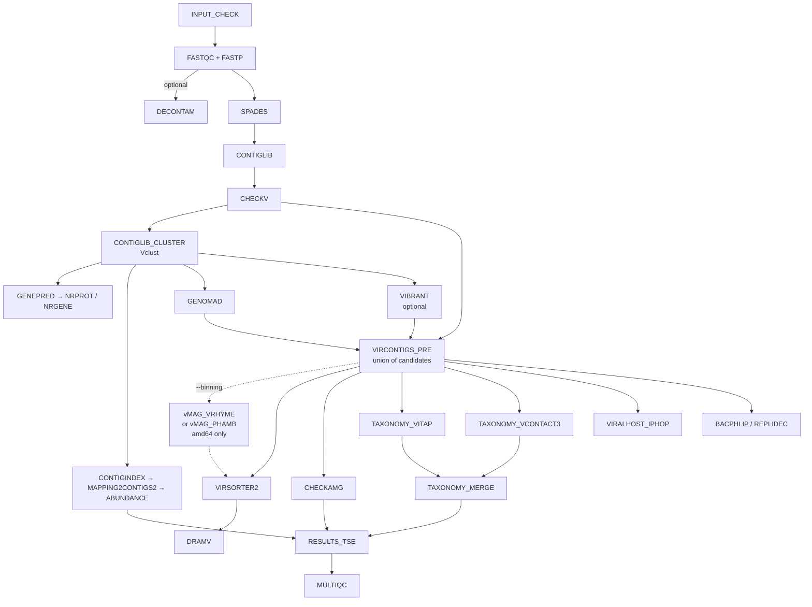

# Handoff — modernization of `dev_ru`

State of the 2026 revival of ViroProfiler, and what a new working session needs to know.
Companion documents: [KNOWN_ISSUES.md](dev/KNOWN_ISSUES.md) (every defect found, with status),
[ARM64.md](dev/ARM64.md) (what can and cannot be built for aarch64),
[PACKAGING.md](dev/PACKAGING.md) (whether to move the images to pixi).

## Where the pipeline stands

The pipeline runs end to end and produces a TreeSummarizedExperiment. On a two-sample test
(HT02, UC20) from a cold start with no resume cache, on aarch64 with the pixi-built images
and `--use_dram false`: 28 processes, 0 failures, and a viral TSE of 18 contigs × 2 samples
with `counts`, `tpm`, `tmm` and `covfrac` assays and 37 `rowData` columns. Sixteen of those
contigs carry a merged lineage, assembled from VITAP and vConTACT3.

That is a low bar in absolute terms — two samples, 22 contigs in the dereplicated library —
but it is the shape every change here is measured against.

Everything below is committed on `dev_ru` and **not pushed**, so that it can be squash-merged
into `main`.

## Pipeline shape



Two relationships in that graph are easy to misread and expensive to get wrong:

- **VirSorter2 is not a detector.** Detection is the union formed in `VIRCONTIGS_PRE` from
  geNomad, CheckV quality and optionally VIBRANT. VirSorter2 runs *downstream* of that union
  purely to emit `viral-affi-contigs-for-dramv.tab`. Remove it and `DRAM-v.py distill` raises
  `KeyError` on `auxiliary_score`, a column `add_dramv_scores_and_flags()` creates only when
  VirSorter2 output is present.
- **`CONTIGLIB_CLUSTER` dereplicates *all* contigs, not just viral ones.** Its output is the
  read-mapping reference for abundance, which is why viral identification happens after it
  rather than before. Moving geNomad ahead of it would quietly change what `RESULTS_TSE`
  reports abundance for.

## Running it on this machine

The published `denglab/*` images are amd64-only, so this aarch64 host uses locally built SIFs
through the `arm64_local` profile:

```bash
nextflow run main.nf \
  -profile apptainer,arm64_local -resume \
  --sif_dir ~/singularity/viroprofiler-pixi \
  --input samplesheet.csv \
  --db /mnt/scratch/db/viroprofiler \
  --container_binds /home/allen/data2/db,/mnt/nas26/db,/home/allen/bioinfo/models \
  --use_dram false \
  --max_cpus 8 --max_memory 32.GB
```

Two things about that command are not obvious:

- **`--container_binds` is required here, not optional.** Nextflow invokes Apptainer with
  `--no-home`, so nothing outside the work directory is visible unless it is bound. Several
  entries under `--db` are symlinks into `~/data2/db` and `/mnt/nas26/db`, and the geNomad
  database is a *two-hop* symlink whose second hop lands in `~/bioinfo/models` — that third
  path is why the first real geNomad run failed.
- **`--use_dram false` is a local convenience, not a recommendation.** The DRAM database is
  built and working; DRAM is simply the slowest step and is usually not what is being tested.

Databases live at `/mnt/scratch/db/viroprofiler`:

| Database | Size | Location |
|---|---|---|
| `dram` | 38 GB | local |
| `vibrant` | 11 GB | local |
| `vitap` | 1.3 GB | local |
| `checkv`, `virsorter2`, `genomad`, `eggnog` | — | symlinks into `~/data2/db` |
| `vcontact3`, `checkamg` | — | symlinks into `/mnt/nas26/db` |

The `taxonomy/` tree there — the MMseqs2 vRefSeq database and the 2022 NCBI taxdump, 3.4 GB —
has no consumer any more and can be deleted.

SIFs live in two directories on this host. `~/singularity/viroprofiler-pixi/` holds the
current, pixi-built set and is what `--sif_dir` above points at;
`~/singularity/viroprofiler/` holds the previous micromamba-built set, kept as a fallback
while the new images are still new. `viroprofiler-taxa.sif` in the older directory is a
leftover of the retired vConTACT2 image and can be deleted.

`bash docker/build_arm64.sh <name>` rebuilds one image; `SIF_DIR=<path>` chooses where the
SIFs go, and defaults to `~/singularity/viroprofiler`. Once the pixi images have been used
for a while, replace the older set and drop the `--sif_dir` override.

## Verification discipline

These are not style preferences. Each one corresponds to a defect that shipped in this
repository and stayed invisible for years.

- **An exit status proves nothing about a database.** VIBRANT's `download-db.sh` ends in an
  unconditional `exit 0` and prints a success message after its setup script has died. DRAM's
  dbCAN download stored an 8 KB HTML landing page as a database. VITAP publishes a `.dmnd`
  that `diamond dbinfo` reads happily and `diamond blastp` rejects. vConTACT3's
  `prepare_databases` reports a failure it did not have. Every `DB_*` process therefore builds
  into the task work directory, checks the *content* of what it produced, and publishes only
  then. Keep it that way.
- **Stub tests validate topology, not schemas.** They pass whether or not a process writes the
  columns its consumers read — the DVF stub advertised `contig_id/dvf_score` while the real
  output was `name/len/score/pvalue/qvalue`, and nothing noticed. When you change an output,
  diff the stub header against a real product.
- **Loosening a version pin on a 2022-era tool is not an upgrade, it is an untested
  environment.** Unpinned solves reached Python 3.14, setuptools 84, snakemake 8, numpy 1.24,
  scipy 1.15 and pandas 3 — breaking DRAM, vConTACT2/3, VirSorter2, eggNOG-mapper and bacphlip
  in five different ways. See [PACKAGING.md](dev/PACKAGING.md): the real fix is lockfiles.
- **A subagent or Codex finding is a lead, not a fact.** Of fifteen Codex findings across this
  work, seven survived verification. Check each against the code before acting.

## How the images are built

Every image except `viroprofiler-host` is built by pixi from a committed lockfile:
`docker/viroprofiler-*/pixi.toml` states the intent, `pixi.lock` records what was chosen, and
`pixi install --locked` fails the build if the two disagree. Each Dockerfile ends with a smoke
test under `env -i` — the environment `.command.sh` actually runs in — so a tool that is
importable but not on `PATH` fails at build time rather than mid-run.

Re-lock deliberately and re-test; a lock refreshed as a side effect of a rebuild is exactly
the failure mode it exists to prevent. In CI gate on `pixi lock --check --dry-run`: plain
`--check` exits non-zero on drift but rewrites `pixi.lock` while doing so.

`viroprofiler-host` stays on micromamba because its conda specs live in the iPHoP fork's own
checkout, and it is amd64-only in any case. Reasoning and per-image notes:
[PACKAGING.md](dev/PACKAGING.md).

## Not done yet

Ordered by how much they change results.

1. **Push the images to Docker Hub.** `conf/modules.config` references tags that exist only as
   local SIFs — `vcontact3`, `vclust`, `vitap`, `genomad`, `checkamg` were never published,
   and the rest now differ from what is published — so every profile other than `arm64_local`
   is currently broken. This is the last step before anyone else can run the pipeline.
2. **Run on amd64.** Nothing here has been built or run on x86-64. `--binning phamb` and
   `--use_iphop` in particular have *no* aarch64 execution path at all, so their first real
   test will be that run.
3. **Restore the `.github/workflows/docker.yml` build matrix**, with
   `pixi lock --check --dry-run` as a gate. Every entry is commented out, so no image is built
   by CI on either architecture, and a lockfile nothing verifies is a comment.
4. **Decide whether the `virsorter2` environment inside `viroprofiler-base` stays.** No
   process reads it — everything that runs VirSorter2 carries the `viroprofiler_virsorter2`
   label and gets its own image — and it is worth about 1 GB. It was left in place so that the
   pixi migration changed packaging and nothing else.
5. Remaining `Open` rows in [KNOWN_ISSUES.md](dev/KNOWN_ISSUES.md), including the committed
   `output_stub*` directories and the literal `${HOME}` in `assets/samplesheet_contigs.csv`.

## Limits of what has been verified

- **Only one dataset, and a small one.** Two samples, 23 contigs. Cluster-level agreement
  between the old BLAST recipe and Vclust was measured on a purpose-built 1600-sequence set
  (99.88 % of clusters identical), but real behaviour at 10⁵ contigs is untested — which
  matters most for the `-max_target_seqs` truncation the switch was meant to fix, since that
  defect only manifests on libraries large enough to trigger it.
- **Nothing has been built or run on amd64.** Every image was built natively on aarch64.
- **`--binning phamb` has never been executed.** Its topology is exercised by the stub, the
  score-table converter is checked against phamb's own parser, and the image asserts the
  random forest deserialises — but VAMB has no aarch64 build, so the path itself has not run
  end to end anywhere. Treat the first amd64 run as its first test.
- **PHAMB's bin calls are approximate by construction.** Its forest was fitted on
  DeepVirFinder's score distribution and is given geNomad's. The two scores share a range and
  a meaning but not a calibration, and the size of the disagreement has not been measured.
  `--binning vrhyme` carries no such caveat.
- **iPHoP and DeepVirFinder cannot run on this host at all** — see
  [ARM64.md](dev/ARM64.md) for the evidence. `use_iphop` is false in the arm64 profile, so
  host prediction is unexercised here.
- **`DB_GENOMAD`, `DB_CHECKAMG` and the fresh-download path of `DB_VCONTACT3` have never been
  run**; existing local databases were reused. Their verification functions were tested
  against real databases in both directions, but the download and publish steps were not.
- **`DRAM-setup.py prepare_databases` with `--use_uniref` was never attempted** (hundreds of
  GB); the pipeline builds with `--skip_uniref`.
- **Two of the pixi-built images have been compared against their micromamba predecessors on
  real data**, and both matched: `viroprofiler-replicyc` (bacphlip byte-identical on four
  phage genomes; Replidec identical in every classification, differing only in row order and
  the last bit of one likelihood) and `viroprofiler-base` (CheckV's `quality_summary.tsv` and
  `checkv_qc_long.fasta`, and the contig-library clustering, all byte-identical on the
  two-sample dataset). The remaining images are verified by their build-time smoke tests and
  by having run in the end-to-end test, not by output comparison against the old images.
